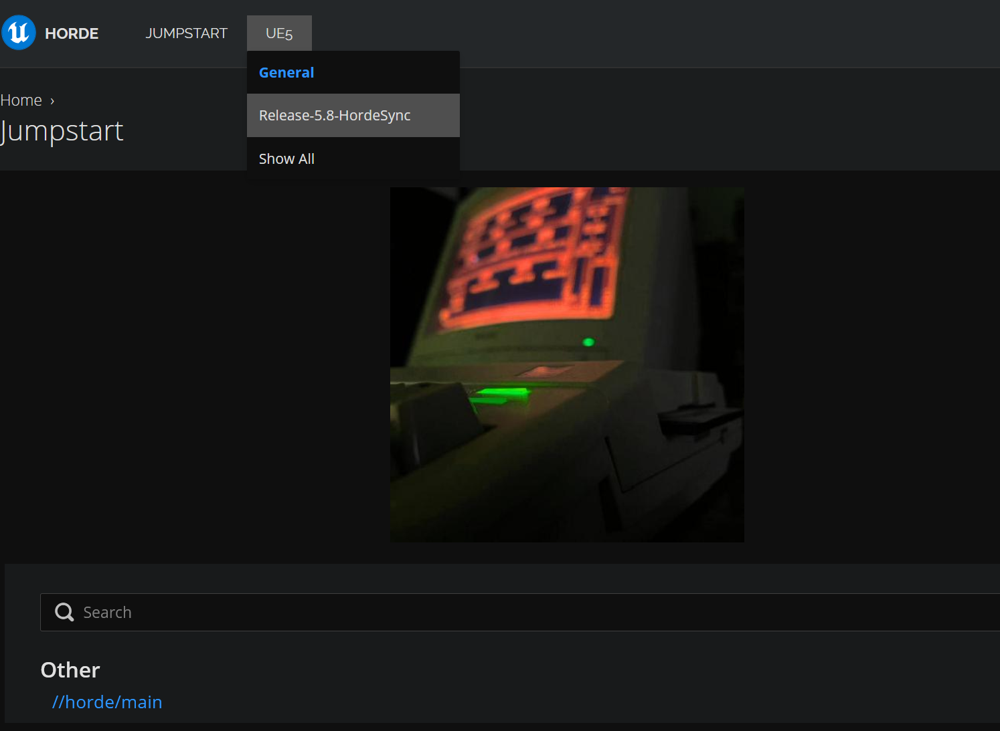
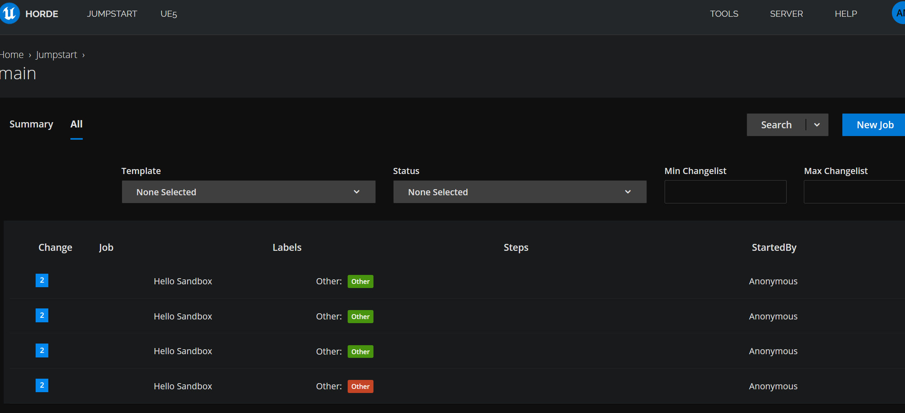
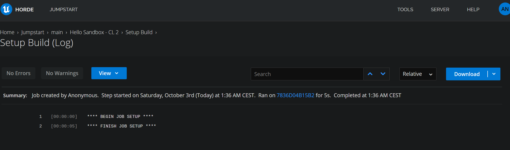
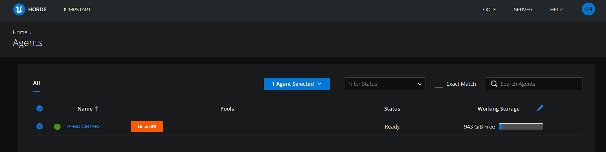
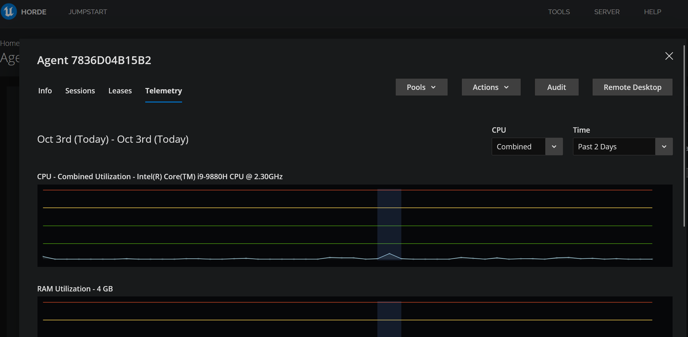
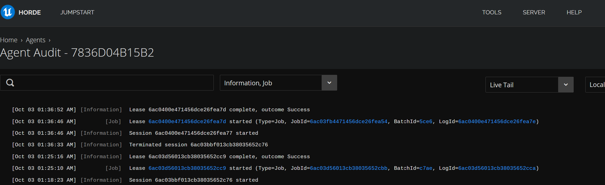

# horde-jumpstart

The easiest way to get hands-on with [Epic Horde](https://dev.epicgames.com/documentation/unreal-engine/horde-in-unreal-engine) in an isolated sandbox on your own machine. 

Target audience: engineers who want to test out Horde in an end-to-end setup scenario. 
This is fully self contained setup with perforce, server, dashboard, agents and buildgraph jobs.

This is not a production setup, but it helps to familiarize yourself with Horde UX, flow, and test your local C# changes with fully operational environment. 

**Everything runs in containers on WSL2. Your host Perforce/P4V environment is never touched.**

## The flow

What happens, in order, from a cold folder to a job running:

- **Stage** — `scripts/up.sh` copies just the engine source subset needed to compile Horde (`Source/Programs/Shared`, `Source/Programs/Horde`, Perforce native binaries) into `build/horde-context`
- **Build** — Docker compiles the Horde server + full web dashboard, and a minimal Linux agent (HordeAgent + JobDriver + `p4` client), from your local engine sources
- **Storage up** — MongoDB (agents, jobs, logs, artifacts) and Redis (live messages, config snapshots) come up on a private compose network
- **Perforce bootstrap** — first p4d boot auto-creates the `horde` stream depot, the `//horde/main` mainline stream, a `horde.build` service user, and submits a seed changelist
- **Server up** — HordeServer connects to Mongo/Redis/Perforce and serves the dashboard at `http://localhost:13340` with anonymous auth — no accounts, no enrollment ceremony
- **Agent joins** — the agent container auto-enrolls, reports its capabilities, and lands in the `linux-ue5` pool via the `Platform == 'Linux'` pool condition
- **Workspaces** — each stream's *agent type* maps to a pool + workspace view; agents own real Perforce stream clients and sync them for jobs that need revision control (the demo `hello` job skips the sync; BuildGraph sync jobs arrive with M4/M5)
- **Job runs** — **New Build** in the dashboard (or one curl) → server leases the batch to a pool agent → the agent spawns a `JobDriver` child process → logs stream live into the dashboard, outcome recorded in job history
- **Iterate** — every config file (server, globals, demo project/stream) is mounted from `server-data/` and hot-reloaded on save; edit, wait a second, done

## Prerequisites

- [UnrealEngine](https://github.com/EpicGames/UnrealEngine) cloned **next to this folder** (`..\UnrealEngine`)
- WSL2 (Ubuntu) with Docker + docker-compose
- No P4V / P4\* env var setup — the sandbox brings its own

## Quickstart

```bash
# From WSL, in this folder:
scripts/up.sh
```

That stages the engine sources, builds the server image, and starts MongoDB, Redis, Perforce, and the Horde server. Then open:

**http://localhost:13340** — dashboard, anonymous auth, click around.

## The stack

| Service        | Inside network   | Host port | Credentials                  |
|----------------|------------------|-----------|------------------------------|
| Horde dashboard| `horde-server:13340` | 13340 | none (Anonymous auth)    |
| Horde agents   | `horde-server:13342` | 13342 | auto-enroll enabled      |
| MongoDB        | `mongodb:27017`  | —         | `horde` / `dbPass123`      |
| Redis          | `redis:30002`    | —         | —                          |
| Perforce       | `p4d:1666`       | 11666     | `horde.build` / `HordeBuild123!` |

All values live in [`.env`](.env). Server config lives in [`server-data/`](server-data/) and is hot-reloaded — edit `globals.json`, save, done.

## Sandbox Perforce

Your host `P4PORT`/`P4CLIENT`/P4V stay untouched — the `p4` binary only ever runs inside a container on the sandbox network:

```bash
scripts/p4.sh info
scripts/p4.sh sync //horde/main/...
```

## Layout

```
.env                       ports + credentials (single source of truth)
docker/docker-compose.yml  the whole stack
docker/horde/Dockerfile    server built from engine sources (no tests, fast)
docker/agent/Dockerfile    minimal Linux agent + JobDriver
docker/p4d/                Perforce image + first-run bootstrap
config/                    appsettings overrides, mounted into the server/agent
server-data/               globals.json / server.json / demo project (editable, hot-reloaded)
docs/                      logo + screenshots
scripts/up.sh            stage + build + start
scripts/stage-context.sh copies engine subset -> build/horde-context
scripts/p4.sh            sandboxed p4 client
```


The `hello` template (server-data/demo.stream.json) runs a Test-executor job
with no Perforce sync. Trigger it from the dashboard (Jumpstart → New Build) or:

```bash
curl -X POST http://localhost:13340/api/v1/jobs \
  -H 'Content-Type: application/json' \
  -d '{"streamId":"main","templateId":"hello"}'
```

There's a second demo project — **UE5** (`server-data/ue5.project.json`, stream
`//UE5/Release-5.8-HordeSync`) — mirroring Epic's real-world stream config: tabs,
parameterized BuildGraph templates, agent types mapped to pools, incremental
workspace view filters. Its jobs target `Win64` agent types, so they queue until a
Windows agent joins — the point is to show what a production-style config looks like
and to edit.

## Dashboard tour

**Project home** — the Jumpstart project with its logo and stream links:



**Jobs history** — completed jobs with status, duration, stream and agent attribution:



**Live job log** — JobDriver output streamed straight from the agent:



**Agents** — who's online in each pool, with capabilities and lease status:



**Agent telemetry** — per-agent CPU/RAM charts from the agent dialog:



**Agent audit trail** — sessions, job leases and outcomes per agent:


